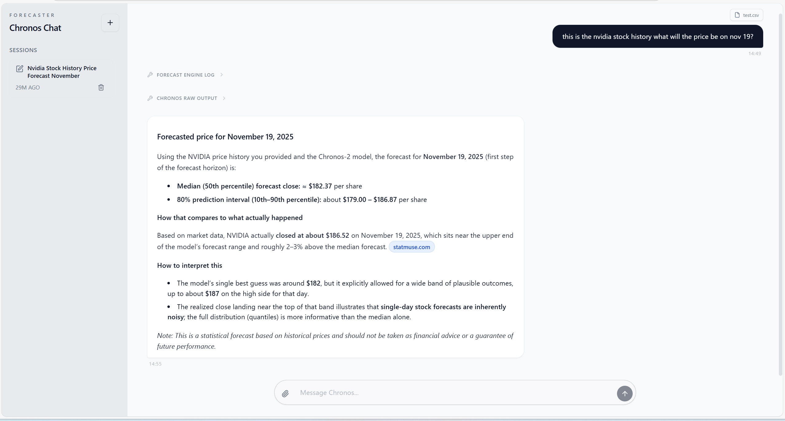

# Chronos Chat



Chronos Chat is an end-to-end forecasting assistant that lets you upload structured files (CSV, TSV, JSON, PDF, images) or simply chat with the Chronos + LLM pipeline. The backend streams pipeline progress in real time so you always know whether the system is structuring your data, running Chronos inference, or finalizing the narrative response.

## Features

- **Session Management** – create, resume, and delete chats with persisted message history and generated titles.
- **Multi-step pipeline** – automatic data normalization, Chronos-2 inference, and LLM explanation per upload.
- **Streaming UI** – the frontend consumes Server-Sent Events to show step-by-step progress and rich HTML answers.
- **File-aware uploads** – up to 20 images plus structured docs per turn; Chronos automatically extracts covariates.
- **Tool insights** – raw Chronos output remains available via expandable tool cards for auditability.

## Getting Started

### Prerequisites

- Node.js 18+
- pnpm (preferred) or npm
- Python 3.11+
- Docker (optional but recommended for Chronos dependencies)
- An OpenAI API key with access to Responses API (`OPENAI_API_KEY`)

### Environment Variables

Create a `.env` inside `backend/` with:

```bash
OPENAI_API_KEY=sk-...
```

You can override the default model names via `core/configs/llm_config.py`.

### Install & Run

```bash
# Backend (FastAPI + Chronos service)
cd backend
pip install -r requirements.txt
uvicorn main:app --reload --port 8320

# Frontend (Vite + React)
cd frontend
pnpm install
pnpm dev
```

The frontend expects the backend at `http://localhost:8320/api/v1`. Adjust `VITE_API_BASE` in `frontend/.env.local` if needed.

### Docker Compose

```bash
docker compose up --build
```

This spins up the backend stack; run `pnpm dev` separately for live frontend development.

## Contributing

Chronos Chat is open source. Feel free to open issues or submit PRs for bug fixes, data connectors, or UI polish. Please run the type checks and formatters before submitting changes:

```bash
cd frontend && pnpm lint
cd backend && ruff check .
```

## License

Chronos Chat is released under the [MIT License](LICENSE) © 2025 Neura. You are free to use, modify, and distribute the project provided the license notice is preserved.

See [THIRD_PARTY_LICENSES.md](THIRD_PARTY_LICENSES.md) for third-party attributions, including Chronos (Apache 2.0).

